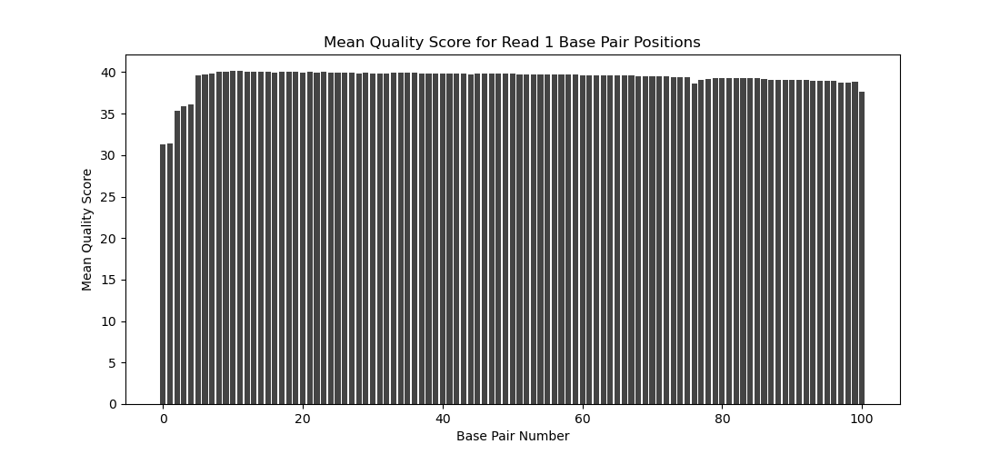
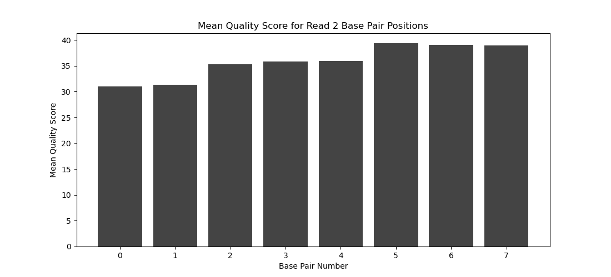
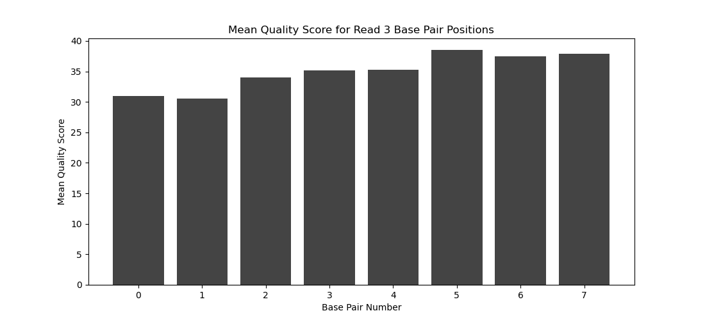
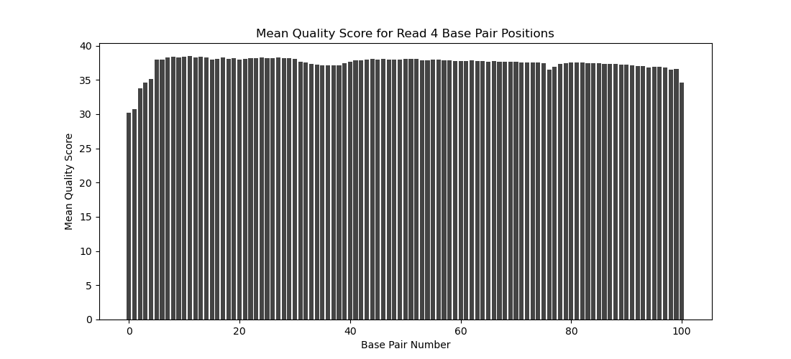

# Assignment the First

## Part 1
1. Be sure to upload your Python script.

| File name | label |
|---|---|
| 1294_S1_L008_R1_001.fastq.gz | read1 |
| 1294_S1_L008_R2_001.fastq.gz | index1 |
| 1294_S1_L008_R3_001.fastq.gz | index2 |
| 1294_S1_L008_R4_001.fastq.gz | read2 |

2. Per-base NT distribution
    1. Use markdown to insert your 4 histograms here.

    
    
    
    

    2.

    ```
    What is a good quality score cutoff for index reads and biological read pairs to utilize for sample identification and downstream analysis, respectively? Justify your answer.

    30 is a good quality score cutoff for index reads and biological read pairs. This number corresponds to a base call accuracy of 99.9%, meaning that the
    chances that this base is called incorrectly are 1 in 1000.
    ```

    3.

    ```
    How many indexes have undetermined (N) base calls? (Utilize your command line tool knowledge. Submit the command you used. CHALLENGE: use a one-line command)

    zcat 1294_S1_L008_R2_001.fastq.gz | sed -n '2~4p' | grep 'N' | wc -l
    3976613

    zcat 1294_S1_L008_R3_001.fastq.gz | sed -n '2~4p' | grep 'N' | wc -l
    3328051

    How many indexes have undetermined (N) base calls? 7304664

    Challenge: zcat 1294_S1_L008_R2_001.fastq.gz 1294_S1_L008_R3_001.fastq.gz | sed -n '2~4p' | grep 'N' | wc -l
    ```

## Part 2
1. Define the problem
2. Describe output
3. Upload your [4 input FASTQ files](../TEST-input_FASTQ) and your [>=6 expected output FASTQ files](../TEST-output_FASTQ).
4. Pseudocode
5. High level functions. For each function, be sure to include:
    1. Description/doc string
    2. Function headers (name and parameters)
    3. Test examples for individual functions
    4. Return statement
